# Z0 政策数据源首次采集时间线与数据量规划

> [Ref: 36_ §15 · z0_policy_feeds.yaml v2.1]
>
> 本文档用于记录所有政策数据源的首次采集安排、数据量预估、增量扫描策略。

---

## 一、总览

| 批次 | 源数 | 完成时间 | 阶段 |
|------|------|---------|------|
| Batch-0（已有） | 6 个 | 已完成 | 日常运转 |
| Batch-1（P0） | 2 个 | 本次上线 | 新源首次全量 + 增量 |
| Batch-2（P1） | 3 个 | 本次上线 + 跟踪确认 | 新源首次尝试 + 增量 |
| Batch-3（P2） | 6 个 | 扩展期按需 | 待立项 |

---

## 二、数据量预估

### 2.1 已有源（Batch-0，不重新采集）

| 源 | 预计全量文档数 | 日均新增 | 全文比例 |
|----|--------------|---------|---------|
| gov.cn 政策库 | ~800 | ~2-3 | >90% |
| gov.cn 首页 | ~200 | ~1 | >90% |
| ndrc 通知公告 | ~400 | ~1 | >90% |
| ndrc 政策发布 | ~300 | ~1 | >90% |
| miit 新闻发布 | ~180 | ~1 | >80% |
| miit 政策文件 | ~250 | ~1 | >90% |
| **小计** | **~2,130** | **~7-10/日** | |

### 2.2 本次新增源（Batch-1 + Batch-2）

| 源 | 首次采集回看天数 | 预估全量文档数 | 日均新增 | 全文比例 | 预估首次 token（~8K/篇） |
|----|----------------|--------------|---------|---------|------------------------|
| **✅ MOST 科技部** | 730 | ~1,500 | ~2 | >90% | ~12M |
| **✅ MOT 交通运输部** | 730 | ~800 | ~1 | >90% | ~6.4M |
| **❓ NEA 能源局** | 730 | ~1,200 | ~1-2 | >80% | ~9.6M |
| **❓ MOF 财政部** | TBD | TBD | TBD | 待确认 | TBD |
| **❓ MOFCOM 商务部** | TBD | TBD | TBD | 待确认 | TBD |
| **小计** | | **~3,500** | **~4-5/日** | | **~28M tokens** |

> ❓ = URL 待确认或需要特殊处理
> **首次 T1 LLM 成本预估（DeepSeek-V3）**：28M input tokens ≈ ¥28（首次回填），建议用 batch 模式 → **~¥14**

### 2.3 增量采集成本

日常增量：~5 篇/日（新增源）+ ~10 篇/日（已有源）= **~15 篇/日**
每日 token：15 × 8K = **120K tokens/日**
每日成本：**~¥0.24/日**（DeepSeek-V3）
每月成本：**~¥5-7/月**

---

## 三、采集时间线

### Phase 1：源确认并上线（本次部署）

| 源 | URL | 状态 | href_contains | 动作 |
|----|-----|------|-------------|------|
| MOST 科技部 | `https://www.most.gov.cn/tztg/` | ✅ 已验证 | `tztg/` | 配置中已添加 |
| MOT 交通运输部 | `https://www.mot.gov.cn/gongkai/zcjd/index.html` | ✅ 已验证 | `zcjd/` | 配置中已添加 |
| NEA 能源局 | `https://www.nea.gov.cn/gzdt/index.htm` | ✅ 已验证 | `nea.gov.cn` | **URL 需更新** |
| NEA 能源局（zfxxgk） | `http://zfxxgk.nea.gov.cn/` | ✅ 需验证 | `nea.gov.cn` | 子域名方式 |
| MOF 财政部 | 待确认 | ⏳ | — | **跳过本次** |
| MOFCOM 商务部 | 待确认 | ⏳ | — | **跳过本次** |

### Phase 2：首次全量（上线后第一次 cron）

```mermaid
gantt
    title 首次全量采集时间线
    dateFormat  HH:mm
    axisFormat %H:%M
    
    section Batch-1
    MOST 科技部（~1500篇）     :b1, 07:45, 1h15m
    MOT 交通运输部（~800篇）   :b2, 07:45, 1h
    NEA 能源局~gzdt（~1200篇） :b3, 09:00, 1h
    
    section T1 LLM
    T1 B1 逐篇LLM评分（~3500篇·batch） :t1, 10:00, 3h
    T1 B2 聚合衰减                     :t2, after t1, 5m
    
    section 验证
    数据源面板验证                     :v1, after t2, 30m
    T1 评分抽样人工确认                 :v2, after t1, 30m
```



### Phase 3：增量日常（部署后每天）

```
08:00  T0 ingest（所有源，最多 80 篇/源）
08:05  T1 B1 LLM（增量文档，最多 ~15 篇）
08:06  T1 B2 聚合
08:15  M0 wind_scan 合成
```

---

## 四、增量扫描策略

| 参数 | 值 | 说明 |
|------|-----|------|
| `max_items_per_feed` | 80 | 每次扫描取最新 80 条 |
| `lookback_days` | 730 | 首次回看 2 年 |
| `fetch_full_text` | true | 全量抓取正文 |
| `full_text_max_chars` | 48000 | 正文截断上限 |
| `min_full_text_chars` | 200 | 正文最小有效长度 |

### 每个源的扫描频率

| 源级别 | 扫描频率 | Cron |
|--------|---------|------|
| L0（gov.cn/ndrc 政策） | 每 60min | 9-18点 |
| L1（MOST/MOT 等部委） | 每 120min | 9-18点 |
| L1（待确认源） | 每 180min | 9-18点 |

### 幂等与去重

```
content_sha256 唯一性保障：
  SHA256(title + summary + full_text) → 幂等入库
  相同 content_hash 跳过

增量检测：
  每源维护 deepsea_feed_watermark 表
  watermark.last_fetch_at → 只抓 > 此时间的文档
```

---

## 五、故障响应

| 故障类型 | 检测方式 | 处理 |
|---------|---------|------|
| 源 404/403 | HTTP status non-200 | 跳过并记录 error，触发管理告警 |
| 连续 3 次空列表 | feed 多次返回 0 条 | 标记为 `source:dead`，人工确认网站是否改版 |
| 全文抓取失败 | `fetch_policy_full_text` 返回 error | 只存 title+summary，无 full_text |
| T1 LLM 失败 | B1 抛异常 | 不写 indicator_state，error 日志告警 |
